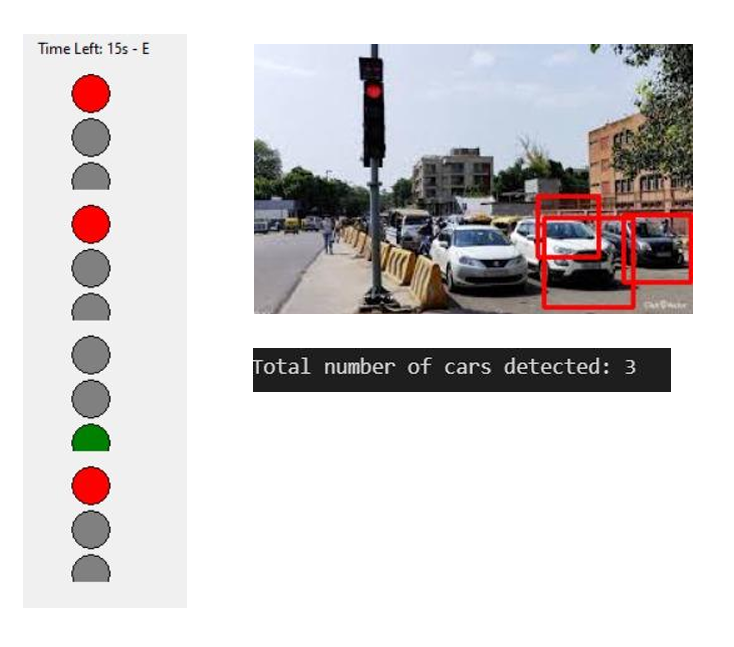

# Automatic Traffic Signal Indicator



An intelligent traffic control system that dynamically adjusts signal timings based on real-time traffic conditions using machine learning and computer vision techniques.

## Overview

This project implements an automatic traffic signal indicator that utilizes live video capture to detect vehicles at intersections and optimize traffic flow. The system analyzes traffic patterns and vehicle density to make informed decisions about signal timings, reducing congestion and wait times.

## Features

- Real-time vehicle detection using Haar Cascade Classifiers
- Dynamic signal timing based on vehicle density
- Visual traffic light simulation using Tkinter
- Traffic flow optimization algorithm that prioritizes directions with higher traffic volume
- Integrated video processing and display

## Requirements

- Python 3.6+
- OpenCV (`cv2`)
- NumPy
- Tkinter (included in standard Python distribution)

## Installation

1. Clone this repository:
   ```
   git clone https://github.com/yourusername/automatic-traffic-signal-indicator.git
   cd automatic-traffic-signal-indicator
   ```

2. Install required packages:
   ```
   pip install opencv-python numpy
   ```

3. Download the Haar Cascade Classifier for vehicle detection:
   - Create a directory named `haarcascades` in the project root
   - Download the `cars.xml` file and place it in the `haarcascades` directory
   - You can find suitable XML files at: https://github.com/opencv/opencv/tree/master/data/haarcascades

## Usage

1. Place your traffic video file in the project directory or prepare your webcam.
2. Update the video path in the script if using a video file.
3. Run the program:
   ```
   python traffic_signal_indicator.py
   ```

4. Use the "Start" and "Stop" buttons to control the system.

## How It Works

### Vehicle Detection

The system uses Haar Cascade Classifiers from OpenCV to detect vehicles in video frames. Each detected vehicle is highlighted with a bounding box, and the count is tracked for each direction.

### Traffic Signal Control

1. The system counts vehicles for each direction (North, South, East, West).
2. Directions are prioritized based on vehicle density.
3. Green light duration is dynamically calculated based on the number of vehicles detected.
4. The system follows a standard green → yellow → red sequence for each direction.

### User Interface

The UI displays:
- Traffic lights for each direction
- Current vehicle counts
- Active direction and countdown timer
- Live video feed with vehicle detection visualization

## Project Structure

- `traffic_signal_indicator.py`: Main application file
- `haarcascades/cars.xml`: Haar Cascade Classifier for vehicle detection
- `README.md`: Project documentation

## Limitations and Future Improvements

Current limitations:
- Vehicle detection accuracy depends on the quality of the Haar Cascade Classifier
- Limited ability to distinguish between different types of vehicles
- Does not account for pedestrian traffic

Future enhancements:
- Implement deep learning-based object detection for improved accuracy
- Add pedestrian detection and crosswalk management
- Incorporate historical traffic data for predictive signal timing
- Add support for multiple camera inputs to monitor different angles of an intersection
- Implement emergency vehicle detection and prioritization

## Contributing

Contributions are welcome! Please feel free to submit a Pull Request.


## Acknowledgments

- This project was developed as part of a machine learning course at NMIMS School of Technology Management and Engineering
- Inspired by research in intelligent transportation systems and smart city initiatives
